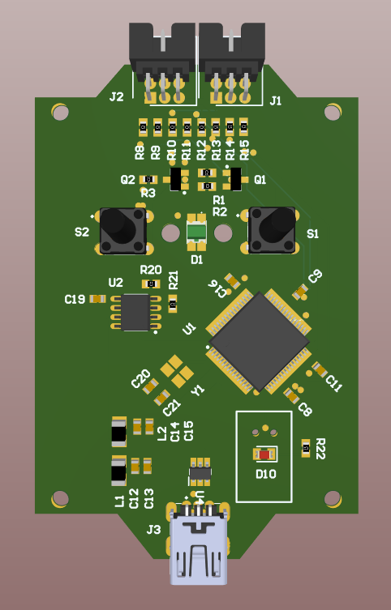
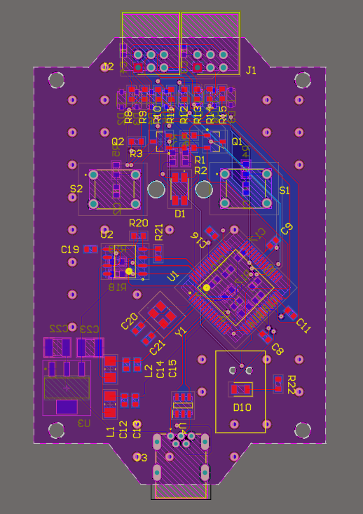
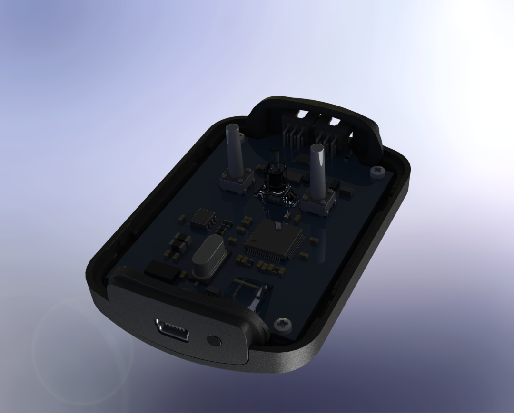

# FlashCraft: Multi-MCU Programmer & Debugger

**FlashCraft** is a versatile and efficient tool designed for programming and debugging microcontrollers like ESP32, PIC, and more. Whether you're a developer, engineer, or hobbyist, FlashCraft simplifies firmware flashing and debugging for embedded systems.



---

## Features

- **Multi-MCU Support**: Works with ESP32, PIC, and more.
- **Intuitive Interface**: Easy-to-use tools for programming and debugging.
- **Cross-Platform**: Runs on Windows, macOS, and Linux.
- **Open Source**: Fully open-source and customizable.
- **Debugging Tools**: Includes breakpoints, step-by-step execution, and real-time monitoring.
- **Firmware Flashing**: Quickly upload firmware to supported devices.

---

## Supported Microcontrollers

- ESP32
- PIC16, PIC18, PIC32

## Altium Components Library and DB :
 ```bash
    https://github.com/Gueni/Library/tree/master/ALTIUM%20LIB
 ```
